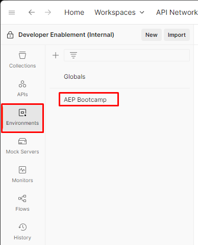

# Setup Environment File

## Postman Environment File


Environment File


## **Import Environment File**

1. Open the `Environment File` from above in your browser by clicking on the file
2. Copy the URL of the file to your clipboard
3. Launch Postman on your local machine and click on the `Import` button within your workspace
4. Paste the URL of the `Environment File` into the import modal text box on the overlay.  This should trigger an automatic import

<figure><figcaption>
Import Button
</figcaption></figure>

 

<figure><figcaption>
Import Button Overlay
</figcaption></figure>

Once imported, you can validate your environment file exists by clicking on the `Environments` tab in the left sidebar.  You should see something similiar to below.

<figure><figcaption>
AEP Bootcamp Environment
</figcaption></figure>

## Environment Variables

Before you can make any API calls you need to update two variables within the Postman Environment you just imported.&#x20;

* `SANDBOX_NAME` - tells the Experience Platform what sandbox to execute the call in
* `PRIVATE_KEY` - the developer projects private key allowing you to request an `ACCESS_TOKEN`


Your sandbox value and private key can be found within the Microsoft Teams folder under `General -> Files`


## Update Sandbox Name

1. Click on the `Environments` tab in the left sidebar of Postman
2. Next click on the `AEP Bootcamp` environment file
3. Locate the `SANDBOX_NAME` variable and update the `Current Value` to your sandbox name
4. Save your updates by clicking the `Save` button in the top right of the environment workspace

When you are done your environment file should look like this:

<figure><figcaption>
Environment File with SANDBOX_NAME
</figcaption></figure>

## Update Private Key

1. Open your environment file again if you closed it.  This time you will be adding the private key.
2. Copy the value of the private key from the teams
