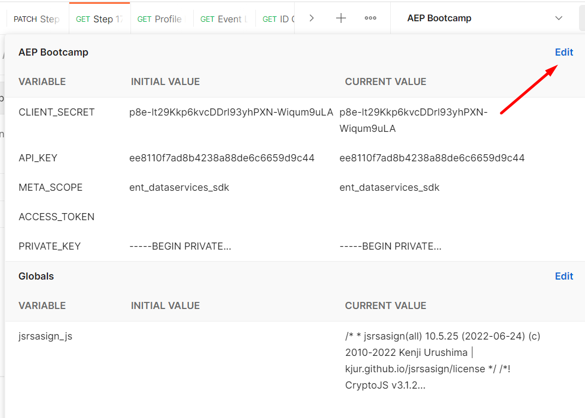

# Import Configuration File

## 1. **Import the environment configuration file.**

* <mark style="color:red;">**Link for the configuration file**</mark>
* Click on the **“import”** button

.png>)

* **“upload”** the provided environment configuration file

.png>)

* The file will be automatically identified as an **“environment”** file

.png>)

* Once imported, your environment file will appear top right hand corner as shown below.

.png>)

## **2. Add the “SANDBOX\_NAME” variable into your environment file.**

* Click on the **“Environment Quick Look”** button next to your Environment File\

* Click **“Edit”** button to add the variable for Sandbox as shown below:\

* Add the variable **“SANDBOX\_NAME”** in the environment file as shown below:

.png>)

* Make sure you hit the “Save” button after you add the variable and the values in both the **“INITIAL\_VALUE”** and “**CURRENT\_VALUE”** Fields. example: _attendee-001_

## **3. Authenticate your Sandbox credentials**

* Click on **“IMS: JWT Generate + Auth via User Token”** API call in the “Authenticate” Folder. **Do not execute it yet.**
* The above API will generate the bearer token for you to authenticate your identity but it’s worth going through the following points in brief to understand the authentication process.
* Make sure that you have the following parameters defined in your environment file. Following parameters should have been made available as part of your postman setup prerequisite. The values of these parameters will be provided by the instructor.
  * CLIENT\_SECRET
  * API\_KEY
  * META\_SCOPE
  * PRIVATE\_KEY
  * TECHNICAL\_ACCOUNT\_ID
  * IMS\_ORG
  * IMS
  * SANDBOX\_NAME
* To establish a secure service-to-service Adobe API session, you must create a JSON Web Token (JWT) that encapsulates the identity of your developer project integration, and then exchange it for an access token. Every request to an Adobe service must include the access token in the Authorization header, along with the API Key (Client ID) that was generated when you created the Service Account Integration in the Adobe Developer Console.
* **Creating a JSON Web Token** A JSON Web Token for Service Account authentication requires a particular set of claims and must be signed using a valid digital signing certificate. Your JWT must contain the following claims (all of which you learn more about [here](https://developer.adobe.com/developer-console/docs/guides/authentication/JWT/))

| exp        | Required. The expiration parameter is a required parameter measuring the absolute time since 01/01/1970 GMT. You must ensure that the expiration time is later than the time of issue. After this time, the JWT is no longer valid. Recommendation: Have a very short lived token (a few minutes) - such that it expires soon after it has been exchanged for an IMS access token. Every time a new access token is required, one such JWT is signed and exchanged. This is secure approach. Longer lived tokens that are re-used to obtain access tokens as needed are not recommended. |
| ---------- | ---------------------------------------------------------------------------------------------------------------------------------------------------------------------------------------------------------------------------------------------------------------------------------------------------------------------------------------------------------------------------------------------------------------------------------------------------------------------------------------------------------------------------------------------------------------------------------------- |
| iss        | Required. The issuer, your Organization ID from the Adobe Developer Console integration, in the format org\_ident@AdobeOrg. Identifies your organization that has been configured for access to the Adobe I/O API.                                                                                                                                                                                                                                                                                                                                                                       |
| sub        | Required. The subject, your Technical Account ID from the Adobe Developer Console integration, in the format: [id@techacct.adobe.com](mailto:id@techacct.adobe.com).                                                                                                                                                                                                                                                                                                                                                                                                                     |
| aud        | Required. The audience for the token, your API Key from the Adobe Developer Console integration, in the format: [https://ims-na1.adobelogin.com/c/api\_key](https://ims-na1.adobelogin.com/c/api\_key).                                                                                                                                                                                                                                                                                                                                                                                  |
| metascopes | Required. The API-access claim configured for your organization: JWT Metascopes, in the format: "[https://ims-na1.adobelogin.com/s/meta\_scope"](https://ims-na1.adobelogin.com/s/meta\_scope%22): true                                                                                                                                                                                                                                                                                                                                                                                  |

* **Bootstrapping the Authentication process –** To be able to authenticate, Adobe has developed a collection that locally signs the JWT on your machine and then passes that JWT in the call to Adobe's Identity Management Service (IMS) to authenticate. To locally sign the JWT a crypto JavaScript library is loaded as part of a pre-request script in the Postman request. This script uses the “RSA-Sign JavaScript Library” and creates a Global Postman environment variable (which persists even if you close Postman, nice!). The response from the request to Adobe's IMS will always respond with the following upon a successful call

.png>)

* Execute “IMS: JWT Generate + Auth via User Token” by clicking the “Send” button

.png>)

* Sample Response looks like below:

.png>)

* Make sure your Environment file has the right parameters populated. Common errors you could get are:
  * Invalid IMS

.png>)

*   **Invalid IMS\_ORG**

    <figure><figcaption></figcaption></figure>

    *
