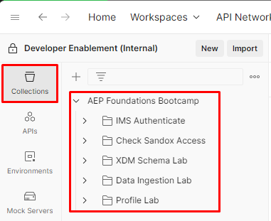

# Import API Collection

## Postman API Collection File


Bootcamp API Collection File


## Import API Collection

1. Open the `Postman API Collection File` from above in your browser by clicking on the file
2. Copy the URL of the file to your clipboard
3. Launch Postman on your local machine and click on the `Import` button within your workspace
4. Paste the URL of the `Postman API Collection File` into the import modal text box on the overlay.  This should trigger an automatic import

<figure><figcaption>
Import Button
</figcaption></figure>

 

<figure><figcaption>
Import Button Modal Text Box
</figcaption></figure>

You should now see a collection populated under the left sidebars `Collections` tab called `AEP Foundations Bootcamp`

<figure><figcaption></figcaption></figure>

## **AEP Foundations Bootcamp Collection Overview**

The API collection you imported contains all the necessary API calls you will need for labs throughout the bootcamp.  Each lab is organized into a specific folder with its own set of APIs.  Please be aware of this as you work through labs this week.

Details about each folder can be found below:

* **IMS Authenticate** - contains a single request to generate an access\_token which is required when working with any of the Adobe Experience Platform APIs
* **XDM Schema Lab** - contains a set of requests for creating the XDM components necessary for building and configuring a schema for the Real-Time Customer Profile
* **Data Ingestion Lab** - contains a set of requests for streaming data into the Experience Platform
* **Profile Lab** - contains a set of requests for viewing the Real-Time Customer Profile's traits and behaviors


Congratulations!  You have successfully imported the bootcamp's Postman Collection

