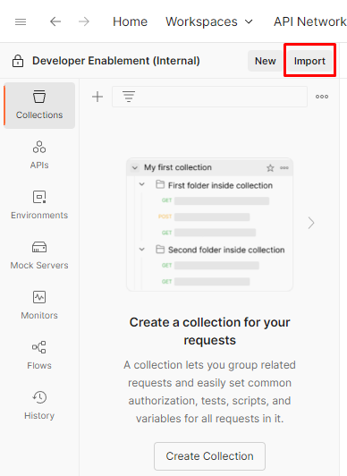
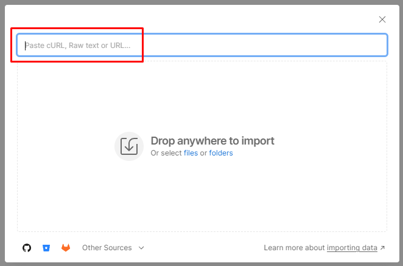
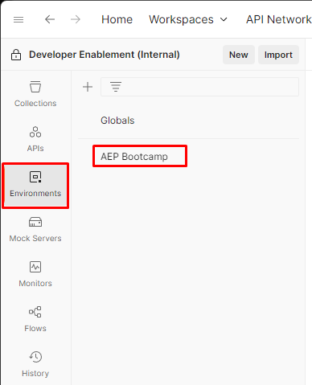

# Import API Collection

## Postman Files


Environment File



API Collection


## **Import Environment File**

1. Open the `Environment File` from above in your browser by clicking on the file
2. Copy the URL of the file to your clipboard
3. Launch Postman on your local machine and click on the `Import` button within your workspace
4. Paste the URL of the `Environment File` into the import modal text box on the overlay.  This should trigger an automatic import

<figure><figcaption>
Import Button
</figcaption></figure>

 

<figure><figcaption>
Import Button Overlay
</figcaption></figure>

Once imported, you can validate your environment file exists by clicking on the `Environments` tab in the left sidebar.  You should see something similiar to below.

<figure><figcaption>
AEP Bootcamp Environment
</figcaption></figure>

## Update Environment Variables

Before you can make any API calls you need to update two variables within the Postman Environment you just imported.&#x20;

* `SANDBOX_NAME` - tells the Experience Platform what sandbox to execute the call in
* `PRIVATE_KEY` - the developer projects private key allowing you to request an `ACCESS_TOKEN`


Your sandbox value and private key can be found within the Microsoft Teams folder under `General -> Files`


1. Click on the `Environments` tab in the left sidebar of Postman
2. Next click on the `AEP Bootcamp` environment file
3. Locate the `SANDBOX_NAME` variable and update the `Current Value` to your sandbox name
4. Save your updates by clicking the `Save` button in the top right of the environment workspace

.png>)

**This collection has the following folders: AEP Bootcamp API Lab collection**

* **IMS Authenticate**
  * Contains all the API call to authenticate the client credentials to execute API calls.
* **XDM API Lab**
  * Contains all the API calls to create XDM components like Schema, Field Groups, Primary/non-primary and Relationship Identities.
* **Reference API Calls**
  * Contains some reference **“GET”** API calls to help you navigate the Schema registry
  * You can use these API calls to browse the XDM components you created and also to get identifiers of various XDM components which you would need as you go through the API Lab. It would be good to have at least have a glance at these
  * Please note that you will have to **create/POST** the XDM components first to expect results in the GET API calls.
  * Below is a sample screen shot of the folders in your **POSTMAN** collection.
* **Pipeline API Lab**
  * Contains streaming API calls to send Customer and Orders sample payloads
* **Profile API Lab**
  * Contains API calls to lookup profile, experience events and identity graphs.

.png>)
