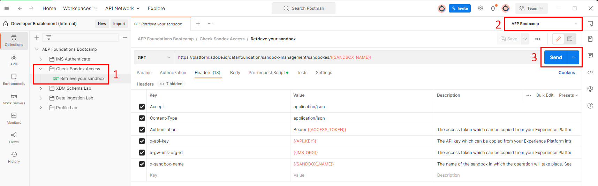

# Validate Sandbox Access

Before you continue we want to double check that your access is legit. Perform the following steps:

1. Open the folder titled `Check Sandbox Access` and click on the call titled `Retrieve Your Sandbox`
2. Next in the upper right corner of Postman you'll see an Environment drop-down box.  Be sure to select the `AEP Bootcamp` environment
3. Execute the call by clicking the `Send` button

<figure><figcaption>
Retrieve your sandbox API call
</figcaption></figure>

A successful response will look like so:


Congratulations!  You have successfully imported the bootcamp's Postman Collection

